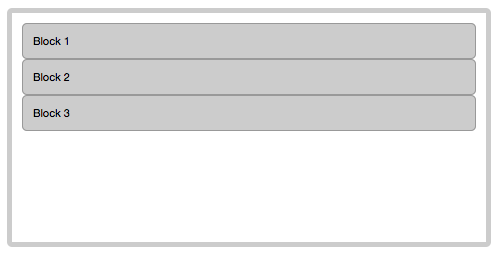
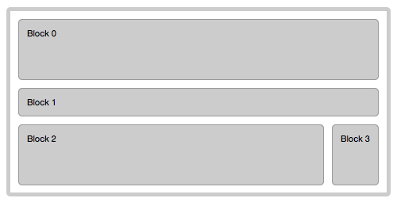
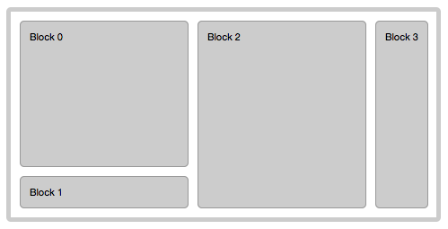
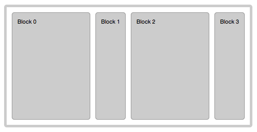
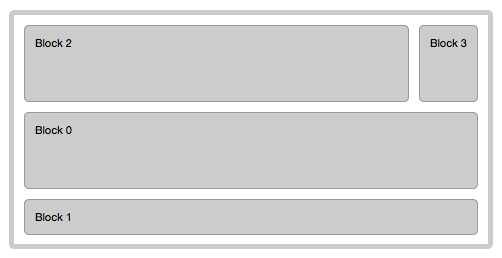

FLEX LAYOUT
==========

## 1. WHAT IS A FLEX LAYOUT?

FlexLayout, like any enyo layout kind, modifies how parent component ( **container** ) and it's **children** are displayed.
FlexLayout is providing for the arrangement of elements on a page such that the elements behave predictably when the page layout must accommodate different screen sizes and different display devices. 

For many applications, FlexLayout provides an improvement over the block model in that it does not use floats, device-inconsistent CSS3 flex-box, nor do the flex container's margins collapse with the margins of its contents. 

A no-css implementation of FlexLayout provides controllable, consistent and easy to use JavaScript API that does not lack in performance speed.

## 2. API

## 3. USAGE OF FLEX LAYOUT

Let's start with the following simple code example:

	```javascript
	enyo.kind({
		name        : 'enyo.sample.FlexLayoutSample',
		classes     : 'flex-container enyo-fit',
		layoutKind  : 'enyo.FlexLayout',
		components  : [
			{content: 'Block 1'},
			{content: 'Block 2'},
			{content: 'Block 3'}
		]}
	);
	
Now apply these styles to it:

	```css
	.flex-container {
		font-size     : 11px;
		border        : 5px solid #CCC;
		padding       : 10px;
		margin        : 10px;
		border-radius : 5px;
	}

		.flex-container > * {
			background-color : #CCC;
			text-align       : justify;
			border           : 1px solid #999;
			padding          : 10px;
			border-radius    : 5px;
		}
	
We will get the following result:



As you can see, even though FlexLayout is fully-javascript and all children are absolutely positioned, all paddings, margins and borders are in place in both, container and it's children.

Now, let's add **flexSpacing** and **flex: true** property on Block2:

	```javascript
	enyo.kind({
		name        : 'enyo.sample.FlexLayoutSample',
		classes     : 'flex-container enyo-fit',
		layoutKind  : 'enyo.FlexLayout',
		flexSpacing : 10,
		components  : [
			{content: 'Block 1'},
			{content: 'Block 2', flex: true},
			{content: 'Block 3'}
		]}
	);
	
The result will be:


You can have as many *flex:true* blocks as you wish. As you resize the browser window, *flex:true* blocks will stretch to share the space left by non-flex blocks.

Let's extend this example by adding one more *flex:true* block, and **flexOrient** to all blocks:


	```javascript
	enyo.kind({
		name        : 'enyo.sample.FlexLayoutSample',
		classes     : 'flex-container enyo-fit',
		layoutKind  : 'enyo.FlexLayout',
		flexSpacing : 10,
		components  : [
			{content: 'Block 0', flexOrient: 'row', flex: true},
			{content: 'Block 1', flexOrient: 'row'},
			{content: 'Block 2', flexOrient: 'column', flex: true},
			{content: 'Block 3', flexOrient: 'column'}
		]}
	);

This will render into:



Note a few things:

- Block2 now flexes in horizontal axis as the window is resized. 
- Column groups automatically comprise flex:true row.
- Height left by non-flex Block1 is equally shared between Block0 and last row comprised of columns Block2 and Block3, because the last row has automatically became *flex:true*

There is one more assumption: the preference is given to rows over columns. For example we are grouping columns into a row and not the other way around.
Let's change that by specifying flexBias, that by default has value *"row"*:

	```javascript
	enyo.kind({
		name        : 'enyo.sample.FlexLayoutSample',
		classes     : 'flex-container enyo-fit',
		layoutKind  : 'enyo.FlexLayout',
		flexSpacing : 10,
		flexBias    : 'column',
		components  : [
			{content: 'Block 0', flexOrient: 'row', flex: true},
			{content: 'Block 1', flexOrient: 'row'},
			{content: 'Block 2', flexOrient: 'column', flex: true},
			{content: 'Block 3', flexOrient: 'column'}
		]}
	);
	
Now the entire grid is biased to see columns as main blocks, not rows. I.e, rows grouped into columns, not columns into rows:



Now, let's remove *flexOrient: 'row'* from Block0 and Block1, leaving *flexOrient* to it's default value:

	```javascript
	enyo.kind({
		name        : 'enyo.sample.FlexLayoutSample',
		classes     : 'flex-container enyo-fit',
		layoutKind  : 'enyo.FlexLayout',
		flexSpacing : 10,
		flexBias    : 'column',
		components  : [
			{content: 'Block 0', flex: true},
			{content: 'Block 1'},
			{content: 'Block 2', flexOrient: 'column', flex: true},
			{content: 'Block 3', flexOrient: 'column'}
		]}
	);
	
	


The *flexOrient* value defaults to *flexBias*, which defaults to 'row'. To see that, let's remove *flexBias*:

	```javascript
	enyo.kind({
		name        : 'enyo.sample.FlexLayoutSample',
		classes     : 'flex-container enyo-fit',
		layoutKind  : 'enyo.FlexLayout',
		flexSpacing : 10,
		components  : [
			{content: 'Block 0', flex: true},
			{content: 'Block 1'},
			{content: 'Block 2', flexOrient: 'column', flex: true},
			{content: 'Block 3', flexOrient: 'column'}
		]}
	);
	


We are back to configuration that we've already seen above.

What if we want to change the order in which the blocks are displayed? Yes, we can do that by specifying **flexOrder** property. 
Let's move column group to the top:

	```javascript
	enyo.kind({
		name        : 'enyo.sample.FlexLayoutSample',
		classes     : 'flex-container enyo-fit',
		layoutKind  : 'enyo.FlexLayout',
		flexSpacing : 10,
		components  : [
			{content: 'Block 0', flex: true},
			{content: 'Block 1'},
			{content: 'Block 2', flexOrient: 'column', flexOrder: 0, flex: true},
			{content: 'Block 3', flexOrient: 'column', flexOrder: 1}
		]}
	);



Now that we've explored *flexOrient* and *flexOrder*, we can see how by changing them a responsive design can be achieved.

## 4. RESPONSIVE DESIGN WITH FLEX LAYOUT


