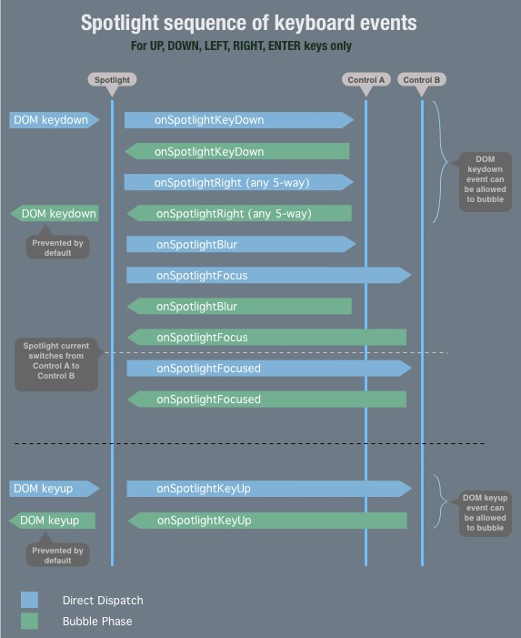
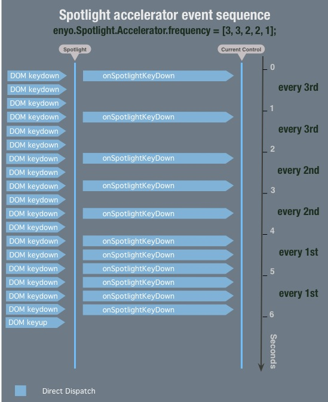
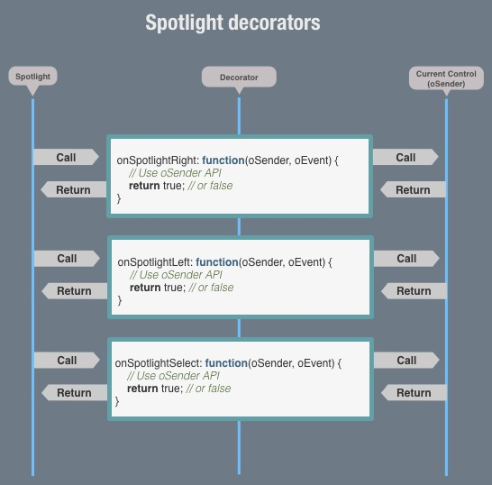

# SPOTLIGHT DOCUMENTATION #

1. [What Is Spotlight?](#1)
2. [Modes](#2)
3. [Navigation](#3)
4. [Containers](#4)
5. [Nesting](#5)
6. [Events](#6)
	1. [List of Spotlight Events](#6.1)
	2. [Preventing/Allowing Default DOM Events](#6.2)
	3. [Sequence of Spotlight Events](#6.3)
	4. [Accelerated keydown Events](#6.4)
	5. [Scroll Events](#6.5)
	6. [Default 5-way controls](#6.6)
7. [Extending Spotlight](#7)
	1. [Spotlight Decorators](#7.1)
	2. [Extending Controls](#7.2)

## 1. WHAT IS SPOTLIGHT? ##

Spotlight is an extensible utility that enables users to navigate Enyo
applications using a keyboard or television remote control.  Responding to input
from the **UP**, **DOWN**, **LEFT**, **RIGHT**, and **RETURN** keys, Spotlight
provides a navigation experience that compares favorably to that of a mouse on a
computer.

In addition, Spotlight includes support for Point-and-Click events, so all bases
are covered.

To add **[Spotlight](kind.Spotlight.js)** to an application, simply include the
`Spotlight` package in your `package.js` file.

## 2. MODES ##

Spotlight operates in two mutually exclusive modes: **5-way mode** and **Pointer
mode**.  By default, it is configured to switch between these modes whenever
suitable input is received--i.e., it switches to pointer mode on `mousemove`,
and back to 5-way mode on `keydown`.

The Spotlight API also provides a way to explicitly perform the switch:

    `Enyo.Spotlight.setPointerMode([BOOLEAN]);`

## 3. NAVIGATION ##

**[Spotlight](kind.Spotlight.js)** allows navigation between Enyo controls by
assigning focus to one control at a time.  When a control is focused, it takes
on the CSS class `.spotlight`, which allows focused controls to be styled on a
per-kind basis using `.<kindClass>.spotlight` selectors.

In order to make a control focusable (or **"spottable"**) with Spotlight, simply
set its `spotlight` property to `TRUE`, like so:

    {name: 'mybutton', tag: 'button', spotlight: true}

Note that Enyo UI libraries such as _Moonstone_ are built with default Spotlight 
support, such that any control can be focused using pointer or 5-way keys without 
setting any special flags or configuration.  In general, setting the `spotlight:true`
flag explicitly is only required when building custom UI controls or libraries.

When the application loads, there will generally be no focused control on screen
until the user moves the mouse or presses an arrow key.  If no control has been focused
yet, Spotlight will choose the first spottable control on screen upon the first
arrow press.

In 5-way mode, Spotlight uses the
[Nearest Neighbor Algorithm](kind.Spotlight.NearestNeighbor.js) to determine
which spottable control is the nearest in the direction of navigation.  The
coordinates of a spottable control are derived from its actual position on the
screen.

It's worth noting that spottable controls may be found on different hierarchical
levels of an Enyo component tree.  Spotlight facilitates seamless navigation
between the topmost spottable components found in the tree.

## 4. CONTAINERS ##

In order to organize controls into navigation groups, we have created Spotlight
containers. 

A good example use case for containers is a set of radio buttons that must be
navigable separate from the rest of the app's controls.

When a Spotlight container is focused, it passes the focus to its own hierarchy
of spottable child controls--namely, to the last spottable child to hold focus
before the focus moved outside of the container.  If the container in question
has never been focused, it passes focus to its first spottable child.

To define a container, set a control's `spotlight` property to `"container"`:

    {name: 'mycontainer', spotlight: 'container', components: [<A LIST OF spotlight:true CONTROLS>]}

In a way, containers may be thought of as the branches--and `spotlight:true`
controls as the leaves--of the Spotlight navigation tree.

## 5. NESTING ##

Spotlight containers may be nested.  The inner containers may be remembered as
"last focused children" of the outer ones; they act as conduits of focus passed
by the outer containers.

We have not found it useful to nest `spotlight:true` controls.  For now, these
controls act as the leaves of the spottable tree and do not conduct focus;
however, this behavior may be overridden on a per-control basis.

## 6. EVENTS ##

All Spotlight events are dispatched directly to the currently spotted control,
which may prevent bubbling to define custom behavior. (See [Extending Spotlight](#7).)

If Spotlight events are allowed to bubble to the application level, the app
responds to them with default behavior.

 

### 6.1. List of Spotlight Events ###

The following events are dispatched by the main Spotlight module:

#### 5-way mode

- **onSpotlightKeyDown**: Dispatched in response to `keydown`
- **onSpotlightKeyUp** Dispatched in response to `keyup`
- **onSpotlightLeft**: Dispatched in response to `onSpotlightKeyDown` event's
    bubbling to app level with keyCode 37
- **onSpotlightRight**: Dispatched in response to `onSpotlightKeyDown` event's
    bubbling to app level with keyCode 39
- **onSpotlightUp**: Dispatched in response to `onSpotlightKeyDown` event's
    bubbling to app level with keyCode 38
- **onSpotlightDown**: Dispatched in response to `onSpotlightKeyDown` event's
    bubbling to app level with keyCode 40
- **onSpotlightSelect**: Dispatched in response to `onSpotlightKeyDown` event's
    bubbling to app level with keyCode 13
- **onSpotlightFocus**: Dispatched when focus is transferred to a new control
    in response to events 3 through 7.
- **onSpotlightBlur**: Dispatched when focus is transferred away from a control
- **onSpotlightFocused**: Dispatched in response to `onSpotlightFocus` event's
    bubbling to app level right after its originator is set as current
- **onSpotlightScrollUp**: Dispatched when `mousewheel` event delta exceeds
    `enyo.Spotlight.Scrolling.frequency` (Default: 40)  
- **onSpotlightScrollDown**: Dispatched when `mousewheel` negative event delta exceeds
    `-enyo.Spotlight.Scrolling.frequency` (Default: 40)

      

### 6.2. Preventing or Allowing Default DOM events ###

By default, if a `keydown` event carries a 5-way keyCode (13, 37, 38, 39 or 40),
it will be prevented from bubbling and triggering default browser behavior.
This is done to disable default browser scrolling, because in the presence of
Spotlight, scrolling is handled using components such as Scroller.

Of course, there are some cases where you may want to allow the default browser
behavior.  For example, in text inputs, you may want to allow the cursor to move
to the next character when the right arrow key is pressed, without any
interference from JavaScript. 

For such cases, we have included an **Allow DOM Default** feature.  The events
`onSpotlightKeyDown`, `onSpotlightLeft`, `onSpotlightRight`, `onSpotlightUp`,
`onSpotlightDown` and `onSpotlightSelect` pass their handlers an event object
with an added `allowDomDefault` method:

    onSpotlightKeyDown: function(oSender, oEvent) {
        oEvent.allowDomDefault();
    }

In the above handler, if the Spotlight event is allowed to propagate, it will
allow the original DOM `keydown` to trigger default browser behavior. (See
[Figure A](#A)).
   
   

### 6.3. Sequence of Spotlight Events ###

Figure A
--------

[Figure A](#A) illustrates the sequence of events in Spotlight's 5-way mode.  At
each step, the sequence may be modified (bubbling may be prevented) on the level
of the currently focused control.  (See [Extending Spotlight](#7).)

For instance, when `onSpotlightKeyDown` is dispatched to the focused control,
the control may choose to prevent it from ever reaching the app level (where it
would be handled by Spotlight) and replace the default behavior with its own
custom handling.

If, however, `onSpotlightKeydown` is allowed to propagate and Spotlight
recognizes its keyCode as one of 5-way key codes, it dispatches an
`onSpotlight<5-Way Direction>` event back to the focused control.  At this point,
the control has, yet again, the option of overriding default behavior.

If `the onSpotlight<5-Way Direction>` event bubbles up to the app level,
Spotlight employs its [Nearest Neighbor Algorithm](kind.Spotlight.NearestNeighbor.js)
to figure out which spottable control is closest in the `<5-Way Direction>`.  It
then dispatches an `onSpotlightBlur` event to the current control (which also
has the `.spotlight` CSS class removed), and an `onSpotlightFocus` event to the
nearest neighbor (which has the `.spotlight` CSS class applied).

If `onSpotlightFocus` is allowed to bubble from the newly focused control,
Spotlight sets its originator as `current`, and it officially becomes the
focused control.  In recognition of this fact, Spotlight dispatches
`onSpotlightFocused` to the control.

 

### 6.4. Accelerated keydown Events ###

Figure B
--------

While a key is depressed, the browser dispatches `keydown` events at equal (or
nearly equal) intervals.

Looking at [Figure B](#B), we can see that not all of these events affect the
application.  The function of the [Spotlight Accelerator](kind.Spotlight.Accelerator.js)
is to distribute events over time (according to its configuration).

Spotlight Accelerator may be configured via its array property,
`enyo.Spotlight.Accelerator.frequency`.  The default configuration is as
follows:

    //* Firing configuration. At n-th second use every frequency[n] subsequent keydown event
    frequency : [3, 3, 3, 2, 2, 2, 1], ...

This tells the Accelerator to do the following:

* In the first, second, and third seconds after the key is depressed, only let
    through every third `keydown` event.
* In the fourth, fifth, and sixth seconds, allow every second `keydown` event.
* In the seventh second and later, allow every `keydown` event.

This causes Spotlight focus to move across the screen with apparent acceleration
while a 5-way key is depressed.

 

### 6.5. Scroll Events ###

In response to `mousewheel` events from the browser, Spotlight dispatches
`onSpotlightScrollUp` and `onSpotlightScrollDown`.  Here's how the process
works:

The `mousewheel` event has a `wheelDeltaY` property, which translates to a given
amount of wheel rotation.  [Spotlight Scrolling](kind.Spotlight.Scrolling.js)
accumulates `wheelDeltaY` values in a given direction of rotation (up or down).

Once the cumulative value exceeds `enyo.Spotlight.Scrolling.frequency`,
`onSpotlightScrollUp` or `onSpotlightScrollDown` is dispatched and the
cumulative value is reset to 0.

In this way, Spotlight scrolling events are made to behave more like repeating
keydown events, which is useful for controls like pickers and list scrollers
that don't use smooth scrolling, instead animating from one item to the next.

Note: In [Pointer Mode](#2), Spotlight treats the first scroll event as the
first keyboard event; in response, Spotlight returns from pointer mode and
re-spots the item that was previously spotted. No scrolling happens on the first
scroll event when returning from pointer mode.

### 6.6. Default 5-way controls ###

Sometimes Nearest Neighbor algorithm is just not enough. 
Application UI specs may require you to specify where spotlight focus should move in response to 5-way event.

For cases like that Spotlight has convenience properties:

* **defaultSpotlightUp**
* **defaultSpotlightDown**
* **defaultSpotlightLeft**
* **defaultSpotlightRight**
* **defaultSpotlightSelect**

Simply add them to your control, and if corresponding events is allowed to bubble,
Spotlight will move focus to control, which name is specified in the property:

	{name: 'control1', spotlight: true, defaultSpotlightRight: 'control2'},
	{name: 'control2', spotlight: true, defaultSpotlightRight: 'control1'}
	 
In this example, focus will be passed back and forth between both controls with every right arrow button press.

## 7. EXTENDING SPOTLIGHT ##

There are two ways in which Spotlight functionality may be extended: by using
[Spotlight Decorators](#7.1) or by [Extending existing controls](#7.2).

Each approach has its pros and cons.  Historically, we've needed the positive
aspects of both, so both have been implemented.

 

### 7.1. Spotlight Decorators ###

Spotlight Decorators provide a way to add Spotlight functionality to a control
without altering its code.  This approach is useful when one or more of the
following conditions is true:

* You don't have access to alter a control's code.
* You prefer not to extend the control.
* You want to share the same Spotlight-related code between multiple kinds.

 

**Creating and Applying a Spotlight Decorator**

To create and apply a Spotlight decorator to a kind, do the following:

1. Create a `kind.Spotlight.Decorator.<My-Decorated-Kind>.js` file.

2. Place this file in the `decorators` folder inside the `spotlight` package.

3. In `/decorators/package.js`, add the name of your new file, so it will be
    loaded by default.

4. In the new file, create a decorator kind:  

        name: enyo.Spotlight.Decorator.<My-Decorated-Kind>

5. Add a `statics` block, where the rest of your code will live.

6. Add a static property called `decorates`:   

        decorates: <My-Decorated-Kind>

7. Add an event handler function with the exact same name as the Spotlight event
    you want to handle, e.g.:

        onSpotlightFocused: function(oSender, oEvent) { console.log(oSender, oEvent); }

8. To avoid null reference exceptions, you may add an `if` statement to check
    that `<My-Decorated-Kind>` is present in scope:

        if (window.onyx && onyx.<My-Decorated-Kind>) { /* decorator code */ }

When you run your code and give focus to your desired control, you should see
console log entries referencing an instance of the control `(oSender)` and the
`onSpotlightFocused` event instance `(oEvent)`.

Figure C
--------

Having a reference to a control inside an event handler's scope allows you to
access its API and change its state as desired in response to the event.  Just
as in a regular event handler, returning TRUE-ish values will prevent the
default behavior defined in Spotlight.

If you need to persist a control's state between event handler calls, you can
use the `oSender._spotlight` property object, which Spotlight adds to every
control it decorates:

    oSender._spotlight.focusedTimes ++;

Please refer to the existing **[Spotlight decorators](decorators)** package for
examples.

 

### 7.2. Extending Controls ###

Extending an Enyo control to use Spotlight functionality does not require
knowledge of anything beyond Enyo's inheritance patterns and the information
presented in this document.

To extend a control to use Spotlight, simply create a subkind of the kind you
want to extend and define event handlers to handle Spotlight events.

Please refer to the **[Moonstone](https://github.com/enyojs/moonstone)** package
for examples.
